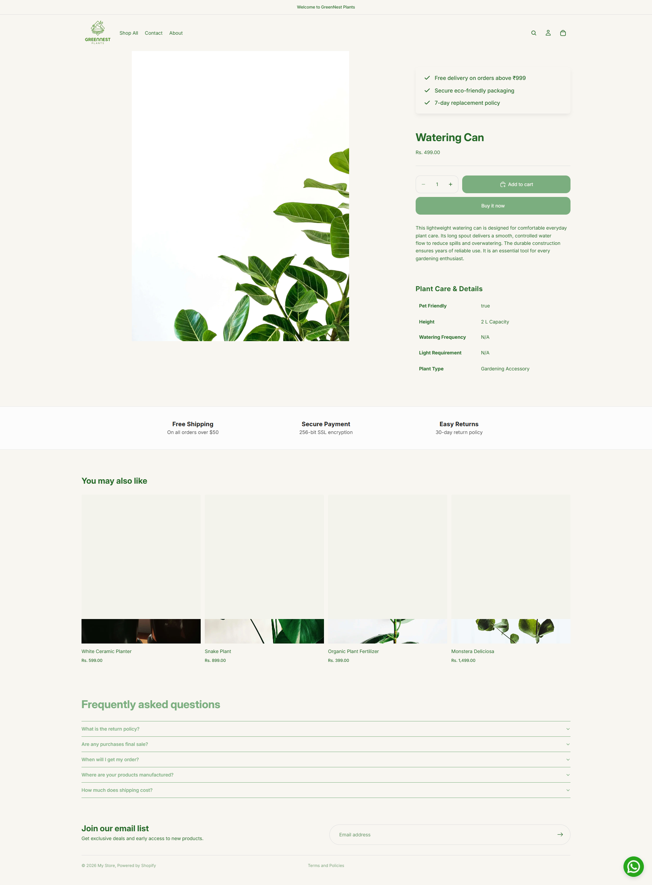
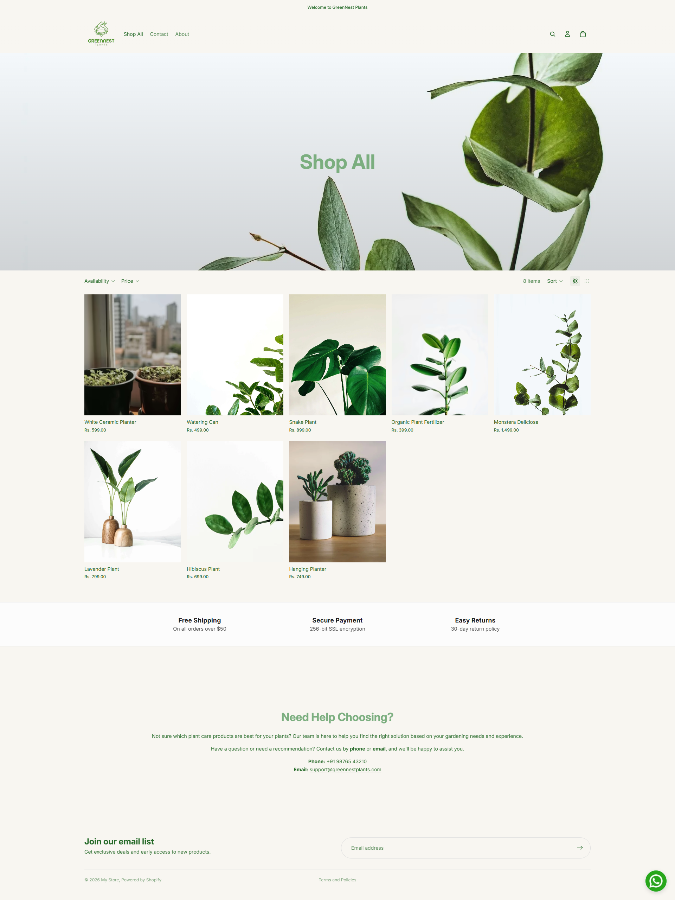

# Shopify Demo Store Overview

## Project Summary

A demo Shopify eCommerce store was created for **GreenNest Plants**, an online plant store offering indoor plants, outdoor plants, planters, and gardening accessories. The store is built using Shopify's **Horizon** theme with a clean, minimalist, and mobile-first design, focusing on usability, responsiveness, and maintainability.

---

## Store URL

**URL:** [https://jiuh0b-e2.myshopify.com/](https://jiuh0b-e2.myshopify.com/)

---

## Implemented Features

### 1. Customized Product Page

The default Shopify product page was enhanced to provide a better shopping experience. The following customizations were implemented:

- Product specifications displayed using Shopify Metafields.
- Custom information blocks for shipping and delivery details.
- Payment and secure checkout information.

---

### 2. Customized Collection Page

The default collection page was customized to improve product browsing.

Implemented features include:

- Enhanced collection layout displaying all products within the selected collection.
- Additional informational section highlighting shipping and delivery information.
- FAQ section to answer common customer questions.
- General information section to improve customer confidence.

---

### 3. Product Metafields & Specifications

Custom product metafields were created to store structured product information instead of adding everything to the product description.

The following metafields were implemented:

- Plant Type
- Light Requirement
- Watering Frequency
- Height / Size
- Pet Friendly
- Pot Included

These values are managed directly from the Shopify Admin and displayed dynamically on the product page, allowing store owners to update product specifications without modifying the theme.

---

### 4. Custom Sections

Two reusable Shopify sections were developed using Liquid.

#### Shipping & Payment Information

A reusable section that displays important purchasing information such as:

- Free Shipping
- Secure Payments
- Easy Returns

All content can be edited through the Shopify Theme Editor.

#### Floating WhatsApp Button

A custom floating WhatsApp section was developed to allow customers to contact the store directly.

Features include:

- Floating button visible across the website.
- Redirects customers directly to WhatsApp.
- Editable phone number.
- Custom WhatsApp icon upload.
- Optional pre-filled WhatsApp message.
- Adjustable position and spacing.
- Fully responsive across all devices.

---

### 5. Mobile Responsive Design

The entire store has been tested and optimized for multiple screen sizes.

The website provides a consistent user experience across:

- Desktop
- Tablet
- Mobile

Layouts, spacing, typography, and images automatically adapt to different screen sizes.

---

### 6. Theme Duplication

Before starting any customization, the original Shopify theme was duplicated.

This follows Shopify development best practices by:

- Preserving the original theme as a backup.
- Allowing safe development without affecting the live storefront.
- Making testing and future updates easier.
- Providing a quick rollback option if required.
---

# Screenshots

## Home Page

---

## Product Page

---

## Shop / Collection Page

